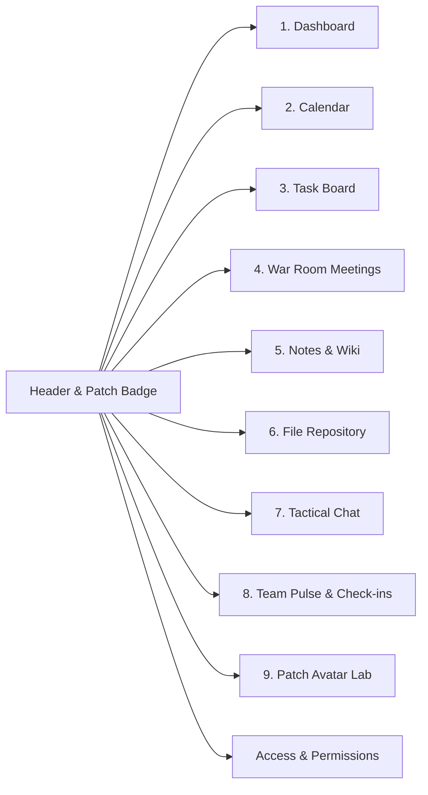

# "Unfounded Venture Lab" — Team Command Center Walkthrough

We have built and deployed a custom, private, work-management web application branded around the **"Unfounded Venture Lab"** patch identity.

The web app is currently live and running locally at:
**`http://localhost:5173/`**

---

## 1. Brand Identity & Visual Aesthetic

The design translates the tactical embroidered morale patch into a digital command center:


- **Palette**: Dark charcoal/black canvas (`#0B0C0E`, `#14171C`), off-white/cream pixel typography (`#EDE8DB`, `#D8D2C2`), tactical gold accents (`#E5B869`), and terminal status highlights (`#5EBA7D`, `#4EC5D4`, `#E05A47`).
- **Physicality**:
  - **45° Chamfered Corners** (`.patch-pill`, `.patch-chamfer-md`, `.patch-chamfer-sm`) on cards, badges, and modals matching the octagonal patch shape.
  - **Overlock Embroidered Seams**: Subtle dashed thread borders (`.border-stitched`) and double-layered stitch highlights.
  - **Twill Fabric Texture**: Subtle crosshatch canvas texture (`.bg-twill`).
- **Typography Pairing**:
  - Retro pixel fonts: `Silkscreen`, `VT323`, and `Press Start 2P` for callsign patches, status emblems, and headers.
  - High-density monospace: `JetBrains Mono` and `Space Mono` for data tables, markdown documents, and chat feeds.
- **Tactile Audio FX**:
  - Built-in Web Audio API mechanical key clicks, patch stamp sounds, and 8-bit celebration chimes for completing tasks and check-ins (toggleable via the audio button in the top header).

---

## 2. Core Modules Implemented



### Module 1: Dashboard (Operator Command Center)
- **Top Dispatch Banner**: Displays the logged-in operator's callsign, security role, live status, and instant lab telemetry (Active Tasks, Completed Tasks, Open Blockers, Node Status).
- **Rearrangeable Widgets**:
  - *My Assigned Tasks*: Shows tasks assigned to the current operator with quick 1-click completion.
  - *Upcoming Engagements*: Highlights today's meetings and task deadlines.
  - *Team Pulse Preview*: Live statuses of all 5 team operators with focus messages.
  - *Operator Quick-Capture Scratchpad*: Auto-saves brain dumps directly into the Knowledge Base.
  - *Direct Mentions & Tactical Pings*: Shows messages where you are `@mentioned` with a 1-click **"Make Task"** button.

### Module 2: Team & Personal Calendar
- **View Modes**: Interactive **Month Grid** with day cells + **Agenda Feed** view.
- **Layer Overlays**:
  - `[x] Team Shared`
  - `[x] Personal Schedule`
  - `[x] War Room Meetings` (Auto-synced)
  - `[x] Task Due Dates & Deadlines` (Auto-synced from Task Board)
- **Filters**: Filter by project (`Project Chimera`, `Blackbox Zero`, etc.) or team operator.
- **Event Modal**: Click any event to inspect location, attendees, linked meeting doc, or originating task.

### Module 3: Tactical Task Board
- **Kanban + List View**: Switch between 4-column tactical Kanban (`To Do`, `In Progress`, `Blocked`, `Done`) and dense tabular list view.
- **Scope Toggle**: Switch between **Team Board** and **My Tasks Only** in 1 click.
- **Task Features**:
  - Subtask checklist with dynamic progress bar.
  - Dependencies indicator (`Blocked by #...`).
  - Priority levels (`Urgent`, `High`, `Medium`, `Low`) with distinct tactical badges.
  - Confetti celebration and retro audio chime when moving tasks to `Done`.

### Module 4: War Room Meetings & Action Item Engine
- **Session Dossier**: Schedule meetings with dates, duration, virtual room URLs, and attendee badges.
- **Live Collaborative Notes**: Collaborative markdown editor that auto-saves briefing summaries.
- **Action Items to Tasks Converter**:
  - Create action items with assignees and deadlines.
  - Click **"Convert to Task"** to automatically spawn a task on the Kanban board and sync its deadline to the calendar!

### Module 5: Notes & Knowledge Vault
- **Triple-Tab Layout**:
  - *Team Wiki / Shared Docs* (Architecture specs, venture doctrine, operating principles).
  - *My Personal Notebook* (Private operator notes).
  - *Brain-Dumps* (Quick-capture snippets).
- **Markdown Live Preview & Editor**: Toggle between formatted preview and markdown text editor.
- **Pinning & Tagging**: Pin mission-critical documents to the top and filter by project code.

### Module 6: Central Tactical File Vault
- **Folder & Project Organization**: Grouped by folders (`Brand & Merch`, `Security Audits`, `Telemetry`, `LP Relations`) and projects.
- **Drag-and-Drop Ingestion**: Drop files directly onto the hatched dropzone for simulated instant client-side ingest.
- **Version History Drawer**: Audit previous revisions (`v1.0`, `v2.0`, `v3.0`), view upload timestamps, and commit new revisions with changelog notes.
- **Interactive Previews**: Live previews for vector patch SVGs, encrypted PDF briefs, and telemetry data.

### Module 7: Tactical Chat Channels & DMs
- **Rooms & DMs**: `#general-command`, `#chimera-ai-lab`, `#deal-flow-scout`, `#hardware-vault`, plus direct messages.
- **Threaded Replies**: Side drawer for in-depth technical discussions on specific messages.
- **Pinned Messages**: Quick-access pinned message bar at the top of each channel.
- **Smart @Mentions**: Typing `@` opens an operator suggestion popup; hovering any message enables 1-click **"Make Task"** creation!

### Module 8: Team Pulse & Async Check-ins
- **Live Status Dispatcher**: Switch status between `Active`, `Deep Focus`, `Reviewing`, `Away`, and `On Leave` with custom focus notes.
- **Team Pulse Board**: Real-time status cards for all 5 team operators.
- **Async Standup Prompt**:
  1. *What key operations did you execute or ship today?*
  2. *What is your next tactical objective?*
  3. *Any blockers, dependencies, or access limitations?*
  4. *Operational Velocity selector* (`⚡ Hyper`, `🟢 Good`, `🟡 Grinding`, `🔴 Blocked`)
- **Blocker Radar**: Red tactical alerts whenever a team member reports an active blocker.

### Module 9: Patch Identity & Personalization Lab
- **Morale Patch Studio**:
  - Real-time custom embroidered patch generator.
  - Choose center emblems: `Crosshair`, `Silicon CPU`, `Radar Sweep`, `High Voltage`, `Tactical Compass`, `Defense Enclave`.
  - Customize overlock thread stitch colors and base fabric twill.
  - Customize personal callsign text (e.g., `VANCE-01`).
- **Dashboard Widget Organizer**: Move widgets up/down to configure your personal home command center.

### Module 10: Private Workspace & Access Control
- **Invite-Only Security**: Restricted to team members with unique workspace invite links and secret airgap keys.
- **Role Permissions**: Admin (Root) vs. Member (Core) role switching and permission enforcement.
- **Full Workspace Backup**: 1-click JSON snapshot export and file restore.

---

## 3. Keyboard Shortcuts Reference

| Shortcut | Action |
| :--- | :--- |
| `Ctrl + K` / `Cmd + K` | Global Command Palette & Workspace Search |
| `Ctrl + Shift + N` | Instant Sticky Brain Dump / Quick Capture |
| `Esc` | Close any active modal |

---

## 4. Verification & Testing

1. **TypeScript Compilation & Production Build**:
   ```bash
   npm run build
   ```
   *Result*: Successfully compiled and built with zero errors in 895ms (`dist/assets/index.js` and `dist/assets/index.css` generated cleanly).
2. **Local HTTP Server Verification**:
   ```bash
   curl.exe -I http://localhost:5173/
   ```
   *Result*: Returns `HTTP/1.1 200 OK` on port 5173.
3. **Multi-Operator Switching**: Tested switching active operator in header between `Jax Vance` (Admin), `Maya Lin` (Admin), `Alex Chen` (Member), `Priya Patel` (Member), and `Marcus Cole` (Member).
